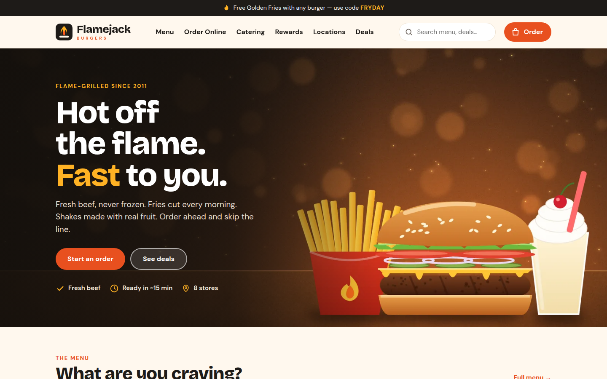
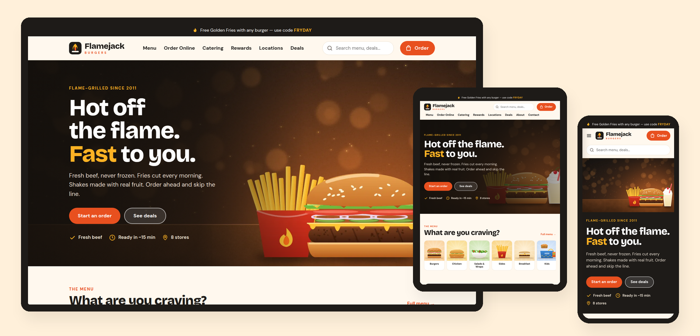

# Flamejack Burgers — SkyNet Fast Food Template

A responsive fast food restaurant website template for **ASP.NET Core (.NET 10)**, built on the **SkyNet Framework**.
Free and open source. **100% AI-driven coding — built by Claude.**

[](https://dotnet.microsoft.com/)
[](https://www.nuget.org/packages/TheSkyLite.SkyNet)
[](LICENSE)
[](#100-ai-driven-coding)

**Live demo:** https://www.theskylite.com/fastfood



> **Fictional brand.** Flamejack Burgers, its stores, menu, prices and deals are invented for demonstration. The checkout is a demo — no payment is taken and no order is placed.

---

## Features

- **10 pages:** Home, Menu, Item, Order Online, Catering, Rewards, Locations, Deals, About, Contact
- **Responsive:** desktop, tablet and phone layouts
  - Desktop: inline menu with hover mega menus
  - Tablet: scrolling menu bar, two-column grids
  - Phone: slide-in menu, sticky *View order* bar at the bottom
- **Menu:** 48 items in 9 categories, with diet filters (vegetarian, spicy, under 600 cal) and sorting by price or calories
- **Item page:** `Item?id=flamejack-classic` — size, add-ons, hold-the-onion options and a combo upgrade; price and calories update on the server as you choose
- **Online order:** bag with quantity controls, pickup or delivery, store and time slot, promo codes, tax, delivery fee and reward points — **every total is calculated on the server**
- **Promo codes:** 6 working codes (percent off, dollar off, free fries, free delivery, half-price shake, big-order discount), each checked against its own rules
- **Catering:** 6 packages, instant quote for 10–300 guests with add-ons, tax and deposit, plus a request form
- **Rewards:** 3 tiers, a points calculator and a reward catalog
- **Locations:** 8 stores with feature filters (drive-thru, open late, delivery, breakfast, catering) and a map with store details
- **Site search:** live suggestions across menu items, deals and stores
- **Quick add:** *+ Add* on any menu card puts the item in the bag without leaving the page
- **Newsletter and contact:** forms with server-side validation (demo — nothing is stored or sent)
- **Artwork drawn in code:** 48 SVG food illustrations and 9 painted WebP banners, made by Claude; no stock photos
- **No front-end build:** plain HTML, CSS and vanilla JavaScript; no npm, no bundler, no SPA framework



---

## Getting started

**Requirements:** .NET 10 SDK and Visual Studio (or any editor with the `dotnet` CLI).

```bash
git clone https://github.com/hkim6000/SkyNet-FastFoodWebsite-Asp.net.Core-Full-Source.git
cd SkyNet-FastFoodWebsite-Asp.net.Core-Full-Source
dotnet run
```

Or open `FastFood.csproj` in Visual Studio and press **F5**.
The SkyNet package (`TheSkyLite.SkyNet`) restores automatically from NuGet.
The app opens on **Home** — the startup page set in `appConfig/application.cfg`.

---

## Project structure

```
FastFood/
├── appConfig/application.cfg     app settings and folder names (startup page = Home)
├── codes/                        page classes (C#)
│   ├── Models/FastFoodModel.cs   data DTOs
│   ├── Home.cs  Menu.cs  Item.cs  Order.cs  ...
├── htmls/                        page markup
├── scripts/                      page JavaScript
├── styles/                       page CSS
├── data/site.json                menu, options, stores, deals, catering, rewards
├── images/
│   ├── banners/                  page banners (WebP)
│   ├── menu/                     menu item art (SVG)
│   ├── hero.webp
│   └── logo.svg
├── Properties/launchSettings.json   hot reload off
└── Program.cs
```

### One page = four files, one name

| File | Holds |
|---|---|
| `codes/Order.cs` | the page class (`: WebPage`) and its server methods |
| `htmls/Order.html` | markup with `{plhd_*}` placeholders |
| `scripts/Order.js` | one IIFE namespace, `OrderJs` |
| `styles/Order.css` | styles, every class prefixed (`od-`) |

Each page is self-contained: its own CSS prefix, its own script and its own C# methods.

---

## SkyNet in action

The browser calls a C# method; the method returns an `ApiResponse`; only those parts of the page change.
One request can return one or more instructions, applied at the same time.

```js
// scripts/Order.js
$ApiRequest('Order/Promo', JSON.stringify([
    { key: 'cart', vlu: 'flamejack-classic~double~bacon.combo~onion~1' },
    { key: 'mode', vlu: 'pickup' },
    { key: 'code', vlu: 'FLAME10' }
]));
```

```csharp
// codes/Order.cs
public async Task<ApiResponse> Promo()
{
    ApiResponse response = new ApiResponse();
    SiteData site = await LoadSite();
    List<CartLine> cart = ParseCart(site, GetDataValue("cart"));
    ...
    response.ExecuteScript("OrderJs.setPromo('" + d.Code + "');");
    Render(response, site, cart, d.Code);   // od-lines, od-totals, od-promo-msg
    return response;
}
```

The bag is kept in the browser as item ids and options only. Prices, discounts, tax and fees always come from the server.

| Page | Request | Response |
|---|---|---|
| every page | `Search` | suggestion list + open it |
| every page | `Quick` | item added + bag badge + toast |
| every page | `Apply`, `Subscribe` | promo saved; message + clear the field |
| Menu | `Filter` | item grid + count |
| Item | `Customize`, `Add` | price and calories; bag updated |
| Order Online | `Update`, `Promo`, `Place` | bag, totals and points; field errors or confirmation |
| Catering | `Quote`, `Send` | itemized quote; field errors or confirmation |
| Rewards | `Points`, `Join` | yearly points and tier; welcome message |
| Locations | `Filter`, `View` | store list + count; store details |
| Contact | `Send` | field errors or confirmation + clear form |

Learn more: [SkyNet Developer Guide](https://www.theskylite.com/documents/SkyNet_Developer_Guide.html)

---

## Customize it

- **Menu and stores:** edit `data/site.json` — items, prices, calories, options, stores, hours, deals, catering packages and rewards
- **Brand name:** search and replace `Flamejack` in `htmls/` and the page titles in `codes/`
- **Colors and fonts:** change the CSS variables at the top of each page's stylesheet (`--hm-flame`, `--hm-mustard`, `--hm-display`, …)
- **Real photos:** replace any image in `images/` with your own and keep the same file names, or update the paths in `data/site.json`
- **Tax and delivery:** the tax rate, delivery fee and free-delivery threshold are in the `Compute` method of each page class

> Checkout, newsletter, contact form and social links are placeholders — connect them to your own payment, POS and mail systems.

---

## 100% AI-driven coding

Every file in this template — C#, HTML, CSS, JavaScript, the artwork and the data — was generated by Claude (Anthropic's AI) from a short instruction, directed and reviewed by the author.
No line was written by hand.

| | |
|---|---|
| Pages | 10 |
| Lines of code | ~16,000 (C#, HTML, CSS, JavaScript) |
| Images | 48 SVG menu items + 9 painted WebP + SVG logo |
| Menu items / stores / deals / catering packages | 48 / 8 / 6 / 6 |
| Lines written by hand | 0 |

SkyNet's simple, predictable page model (one class, four files, `$ApiRequest` → `ApiResponse`) is what makes this possible:
the rules are few and consistent, so AI can generate complete, working pages with very few errors.

---

## License

- **This template** (all source files, artwork and data in this repository): [MIT License](LICENSE) — free to use, modify and redistribute, including commercially.
- **SkyNet Framework** (`TheSkyLite.SkyNet` NuGet package): proprietary, free to use including commercial use; see the license included in the package.

---

## Links

- Live demo: https://www.theskylite.com/fastfood
- SkyNet Framework: https://www.theskylite.com
- NuGet package: https://www.nuget.org/packages/TheSkyLite.SkyNet
- Template #1 — Beauty store: https://github.com/hkim6000/SkyNet-BeautyWebsite-Asp.net.Core-Full-Source
- Template #2 — Pharma company: https://github.com/hkim6000/SkyNet-PharmaWebsite-Asp.net.Core-Full-Source
- Template #3 — Travel blog: https://github.com/hkim6000/SkyNet-TravelWebsite-Asp.net.Core-Full-Source
- SkyNet project template: https://github.com/hkim6000/ASPNETCoreEmpty.SkyNet

© 2026 HC Kim
